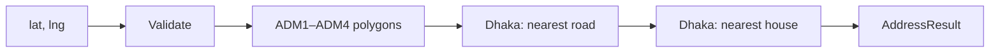

# bd-offline-geocoder

[](https://github.com/TasfiqulGhani/bd-offline-geocoder/actions/workflows/ci.yml)
[](https://pypi.org/project/bd-offline-geocoder/)
[](https://www.npmjs.com/package/bd-offline-geocoder)
[](https://pub.dev/packages/bd_offline_geocoder)
[](LICENSE)
[](https://pypi.org/project/bd-offline-geocoder/)
[](https://www.npmjs.com/package/bd-offline-geocoder)
[](https://pub.dev/packages/bd_offline_geocoder)

<p align="center">
  <b>Offline reverse geocoding for Bangladesh.</b><br/>
  GPS → division, district, upazila / thana / city corporation, union / ward.<br/>
  In Dhaka: nearest <b>road name</b> and <b>house number</b> when OpenStreetMap has them.<br/>
  <i>No API key. No Google bill. No network after install.</i>
</p>

```text
23.74015, 90.38286
→ House 3, Road 3, Dhanmondi, Ward No-49, Dhanmondi Thana, Dhaka 1209, Bangladesh
```

One dataset. Three official-quality SDKs: **Python**, **Node.js / TypeScript**, **Flutter / Dart**.

**Search:** Bangladesh reverse geocoder · offline geocoding Bangladesh · GPS to upazila ward · Flutter Bangladesh location · Node Bangladesh geocoder · Python GIS Bangladesh · Dhaka street name offline

---

## Why people use this

Most “Bangladesh location” code either calls a paid API or stops at district. This repo is a complete offline stack:

| | Google / Mapbox | Nominatim | **bd-offline-geocoder** |
|--|-----------------|-----------|-------------------------|
| Works offline | No | No | **Yes** |
| API key | Yes | Usually | **No** |
| Division → ward | Partial | Varies | **Yes** |
| Dhaka road / house | Yes (online) | Yes (online) | **Yes, from bundled OSM** |
| Language | SDKs | HTTP | **Python + npm + Flutter** |
| Cost at scale | Per request | Rate limits | **Zero after install** |

Built for delivery apps, field-force tools, census/survey clients, ride-hailing, and any backend that must resolve a GPS ping without leaving the VPC.

---

## Install

| Platform | Package | Command |
|----------|---------|---------|
| Python | [bd-offline-geocoder](https://pypi.org/project/bd-offline-geocoder/) | `pip install bd-offline-geocoder` |
| Node / TS | [bd-offline-geocoder](https://www.npmjs.com/package/bd-offline-geocoder) | `npm install bd-offline-geocoder` |
| Flutter | [bd_offline_geocoder](https://pub.dev/packages/bd_offline_geocoder) | `flutter pub add bd_offline_geocoder` |

Package docs (what PyPI / npm / pub.dev render):

- [Python README](packages/python/README.md)
- [npm README](packages/npm/README.md)
- [Flutter README](packages/flutter/README.md)

---

## Quick start

```python
from bd_offline_geocoder import BdOfflineGeocoder

geocoder = BdOfflineGeocoder.from_included_data()  # cached after first load
result = geocoder.reverse(latitude=23.74015, longitude=90.38286)
print(result.formatted)
# House 3, Road 3, Dhanmondi, Ward No-49, Dhanmondi Thana, Dhaka 1209, Bangladesh
print(result.to_dict())
```

```js
import { BdOfflineGeocoder } from "bd-offline-geocoder";

const geocoder = BdOfflineGeocoder.fromIncludedData();
const result = geocoder.reverse({ latitude: 23.74015, longitude: 90.38286 });
console.log(result.formatted);
// House 3, Road 3, Dhanmondi, Ward No-49, Dhanmondi Thana, Dhaka 1209, Bangladesh
console.log(result.toJSON());
```

```dart
final geocoder = await BdOfflineGeocoder.fromBundledAssets();
final result = geocoder.reverse(latitude: 23.74015, longitude: 90.38286);
print(result.formatted);
// House 3, Road 3, Dhanmondi, Ward No-49, Dhanmondi Thana, Dhaka 1209, Bangladesh
print(result.toJson());
```

Outside Bangladesh, `found` is `false` and `formatted` is:

```text
This geocoder only supports locations inside Bangladesh.
```

---

## Result model

```json
{
  "house_number": "3",
  "road_number": "3",
  "road_name": "",
  "area_village": "Dhanmondi",
  "union_ward": "Ward No-49",
  "thana_upazila": "Dhanmondi Thana",
  "district": "Dhaka",
  "division": "Dhaka",
  "postal_code": "1209",
  "city": "Dhaka"
}
```

| Field | When it is filled |
|--------|-------------------|
| `house_number` | OSM house within 50 m (central Dhaka) |
| `road_number` / `road_name` | OSM street within 80 m (central Dhaka) |
| `area_village` | OSM `addr:city` neighborhood, or a custom locality layer |
| `union_ward` | ADM4 union / ward |
| `thana_upazila` | Rural ADM3 upazila, or `{area} Thana` when OSM has a neighborhood inside a city corporation |
| `district` / `division` | ADM2 / ADM1 |
| `postal_code` | Unique Bangladesh Post thana code only |
| `city` | District name when ADM3 is a city corporation |

Empty string means unknown. The library does not invent a thana, house, or postcode.

---

## How it works



1. Reject NaN / non-finite / out-of-range coordinates.
2. Bounding-box reject, then ray-casting on `Polygon` / `MultiPolygon` (holes supported).
3. In Dhaka, nearest LineString and nearest address point in local meters.
4. Format with consecutive-name dedupe (`Dhaka, Dhaka` → `Dhaka`).

See **[docs/ARCHITECTURE.md](docs/ARCHITECTURE.md)** for design notes.

---

## Engineering

| Topic | Implementation |
|-------|----------------|
| Cross-language API | Same types and method names in Python, JS, Dart |
| Geometry without GIS binaries | Ray casting + point-to-segment, no GEOS/Turf |
| Mobile + web | Flutter assets; `fromFile` uses conditional `dart:io` |
| Packaging | One canonical dataset synced into PyPI / npm / pub.dev |
| Ops | Parse-once cache, CI on all three packages |
| Licensing | MIT code + explicit HDX / geoBoundaries / OSM (ODbL) notices |

---

## Repository layout

```text
bd-offline-geocoder/
├── data/boundaries/     Nationwide ADM1–ADM4
├── data/roads/          Central Dhaka named streets (OSM)
├── data/addresses/      Central Dhaka house points (OSM)
├── packages/python/     PyPI
├── packages/npm/        npm
├── packages/flutter/    pub.dev
├── examples/            Runnable demos
├── docs/ARCHITECTURE.md
└── tools/sync_boundary_data.sh
```

```sh
sh tools/sync_boundary_data.sh
```

Published size is large on purpose (~27–29 MB compressed, ~90 MB+ with admin polygons). Offline is the feature.

---

## Examples

```sh
cd examples/flutter_app && flutter pub get && flutter run
node examples/npm/basic-lookup.js
PYTHONPATH=packages/python/src python3 examples/python/basic_lookup.py
```

---

## Data & attribution

- ADM1–ADM3: HDX / OCHA COD-AB Bangladesh (via [meetshaks/bangladesh-administrative-boundaries-json](https://github.com/meetshaks/bangladesh-administrative-boundaries-json))
- ADM4: geoBoundaries, simplified
- Dhaka roads & addresses: © [OpenStreetMap](https://www.openstreetmap.org/copyright) contributors, [ODbL](https://opendatacommons.org/licenses/odbl/)

Code is **MIT**. See [THIRD_PARTY_NOTICES.md](THIRD_PARTY_NOTICES.md).

---

## Author

**[Tasfiqul Ghani](https://github.com/TasfiqulGhani)** — software engineer.

---

## License

MIT. See [LICENSE](LICENSE).
