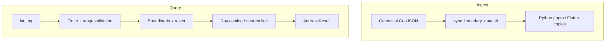

# Architecture

This document is the design note for `bd-offline-geocoder`: one dataset, three runtimes, no GIS engine.

## Problem

Bangladesh apps often need “which thana / ward is this GPS point in?” Offline, without a Maps API key.

Administrative geography here is not a simple grid. City corporations sit beside upazilas. Wards sit inside thanas. A naive string or bounding-box check is wrong at the edges.

## Approach

Do not depend on PostGIS, GEOS, Turf, or native code. Ship GeoJSON and implement the geometry in the host language so Python, Node, and Dart stay aligned.

## Layers

| Layer | Geometry | Match | Coverage |
|-------|----------|--------|----------|
| ADM1 divisions | Polygon / MultiPolygon | Point in polygon | Nationwide |
| ADM2 districts | Polygon / MultiPolygon | Point in polygon | Nationwide |
| ADM3 upazila / thana / CC | Polygon / MultiPolygon | Point in polygon | Nationwide |
| ADM4 union / ward | Simplified polygon | Point in polygon | Nationwide |
| Dhaka named roads | LineString | Nearest segment ≤ 80 m | Central Dhaka |
| Dhaka house numbers | Point | Nearest point ≤ 50 m | Central Dhaka, incomplete |
| OSM `addr:city` | Point property | Neighborhood such as Dhanmondi | Central Dhaka, incomplete |
| Unique thana postcodes | Name lookup | District + area with exactly one code | Nationwide, sparse |

Polygon test: even-odd ray casting, holes treated as subtractive rings, bbox tested first.

Road test: local equirectangular projection (meters), then point-to-segment distance. Cheaper than a full spatial index at this feature count (~7.5k named ways).

## Cross-language contract

The three packages expose the same ideas:

| Concept | Python | Node | Dart |
|---------|--------|------|------|
| Load bundled data | `from_included_data()` | `fromIncludedData()` | `fromBundledAssets()` |
| Reverse lookup | `reverse(latitude=, longitude=)` | `reverse({ latitude, longitude })` | `reverse(latitude:, longitude:)` |
| Result | `AddressResult` | `AddressResult` | `AddressResult` |
| Outside BD | same message string | same | same |

That is deliberate. A developer can move from a FastAPI service to a Flutter client without relearning the model.

## Performance choices

1. **Parse once.** Python and Node cache the bundled geocoder. Flutter loads four admin assets plus two Dhaka layers in parallel.
2. **BBox before polygons.** Most features are rejected without walking rings.
3. **No heavy GIS libs.** Install size is the data, not native binaries. That keeps serverless and mobile builds simple.
4. **Conditional `dart:io`.** `fromFile` exists on VM/desktop and is stubbed on web so the example app still compiles for Chrome.

## Packaging

Registry packages cannot publish files outside their directory. Canonical data lives in `data/`. `tools/sync_boundary_data.sh` copies into each package before publish.

## Honesty about accuracy

ADM4 is simplified. OSM house numbers in Dhaka are sparse. The library prefers a correct ward over a fabricated street. That is a product decision, not a missing feature.

## Engineering

- API design that stays identical across languages
- Computational geometry implemented from first principles
- Offline-first packaging for PyPI, npm, and pub.dev
- Flutter asset + web compatibility constraints
- Clear attribution for third-party geographic data (HDX, geoBoundaries, OSM / ODbL)
